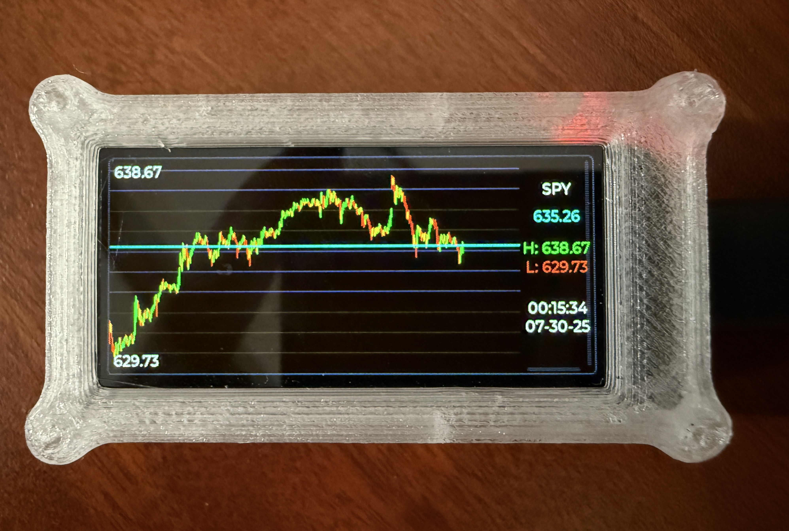

### LilyGo Ticker
Inspired from [this project](https://github.com/nishad2m8/BTC-Ticker), I wanted a simple way to keep up with market price movements during the intraday time frame. This project heavily refactors the linked projects code to accomplish a few key tasks:
1. Pull intraday stock market data for any ticker from Yahoo Finance
2. Display real-time candlestick charts with configurable intervals and bar counts
3. Provide a web interface for dynamic configuration
4. Support 1-pixel wide candles for maximum data density

The specific board I have been using is the [T-Display S3 AMOLED](https://lilygo.cc/products/t-display-s3-amoled-us?_pos=4&_sid=1d7fdbdc0&_ss=r)
If you need a sweet case, check out [this one](https://www.printables.com/model/1222074-lilygo-t-display-s3-amoled-version-20-case-remix) on Printables! 


### Getting Started
1. **Clone the repo**
   ```
   git clone https://github.com/melo-gonzo/LilyGo-Ticker.git
   ```

2. **Flash and configure**
   - Build/upload using PlatformIO
   - On first boot the device raises a WiFi access point (`LilyGoTicker`,
     password `ticker1234`). Join it, open <http://192.168.8.1/wifi>, and pick
     your network — credentials are saved to NVS.
   - After that it is reachable on your LAN at its IP or at
     <http://lilygoticker.local>

   A `src/credentials.h` (copied from `src/credentials_template.h`) is still
   honoured as a first-boot seed if you prefer to bake credentials in, but it
   is no longer required.

3. **Set the timezone** — `TIME_ZONE` in `src/config.h` defaults to US
   Mountain, and the session hours in `src/market_hours.h` are expressed in
   that same zone. Both need to change together if you move zones.

### Over-the-air updates
The board's 16MB partition table already carries dual app slots, so after one
USB flash of this firmware every subsequent update is wireless:

```
pio run -e T-Display-AMOLED-ota -t upload
```

The OTA password is `AP_PASS` from `src/config.h`; the `-ota` env's `--auth`
flag must match. `/status` reports a `fw` build stamp so you can confirm an
update actually landed.

> Some ESP32-S3 boards refuse the esptool stub over USB-JTAG
> (`Unable to verify flash chip connection`). If the initial USB flash fails
> that way, re-run esptool with `--no-stub`.

### Web Configuration
The device serves three pages, on the LAN or on the fallback AP:

| Path | Purpose |
|---|---|
| `/` | ticker configuration |
| `/wifi` | scan, join and forget networks |
| `/status` | JSON health: firmware stamp, clock, market state, link, heap, fetch failures |
| `/candles` | JSON dump of the bars the chart is drawing (`?n=` bar count, `?n=0` for all) |

Configurable on `/`:
- **Stock Symbol**: Enter any ticker (AAPL, NVDA, BTC-USD, etc.)
- **Interval**: 1m, 2m, 5m, 15m, 30m, 1h, 1d intervals
- **Bars to Show**: Configurable based on screen resolution
- **Network Settings**: Static IP or DHCP

Key features:
- Auto-synced candle duration with selected interval
- Real-time price updates always enabled
- Y-axis scaling based on visible data only
- Market hours enforcement (optional)

### Data path
Chart requests are windowed (`period1`/`period2`) and sized so a response can
never hold more bars than the ring buffer, then streamed straight into a
filtered JSON parse — peak RAM tracks the bar count, not the payload size.
Live updates re-fetch only the trailing few intervals and merge them by
timestamp, so candles carry Yahoo's real OHLC rather than an approximation
built from sampled last-prices, and a brief network outage heals itself on the
next cycle.

One Yahoo quirk is worth knowing about: every windowed response carries an
extra entry at `meta.regularMarketTime` holding `open = high = low = close =`
the last traded price. It has second resolution rather than sitting on the
interval grid, and it moves with every request — so merging it naively
appends a flat doji on each fetch cycle and the chart fills up with them.
Bars are therefore only accepted on the series' own grid, and an append has
to clear a full interval.

### Display Features
- **Candlestick Charts**: Green/red candles with proper OHLC visualization
- **Real-time Updates**: Live price line and incomplete candle highlighting
- **Smart Scaling**: 1-pixel minimum candle width for maximum data density
- **Market Status**: Visual indicator when market is closed
- **Price Range**: Dynamic Y-axis scaling to visible bars only

### Development and Contribution
I took this project as an opportunity to test out some of the latest and greatest LLM's for development. I'm a c++ novice, and thus this was a great opportunity to learn. I stuck primarily with the Claude family of models. I found that the "projects" feature was not super helpful, and that pasting the full codebase (or relevant parts) into the context was most helpful for getting assistance. Therefore, I've included the `print_contents.py` script which is helpful for collating the project into one file that can be copy-pasted into the prompt.

Feel free to contribute via Issues and PR's, I will happily review and incorporate changes where necessary.

### Future Plans
- Interval/range combination validation based on Yahoo Finance API limits
- Data persistence across reboots
- Additional technical indicators overlay
- Multiple ticker support with swipe navigation
- Integration with external databases for historical data