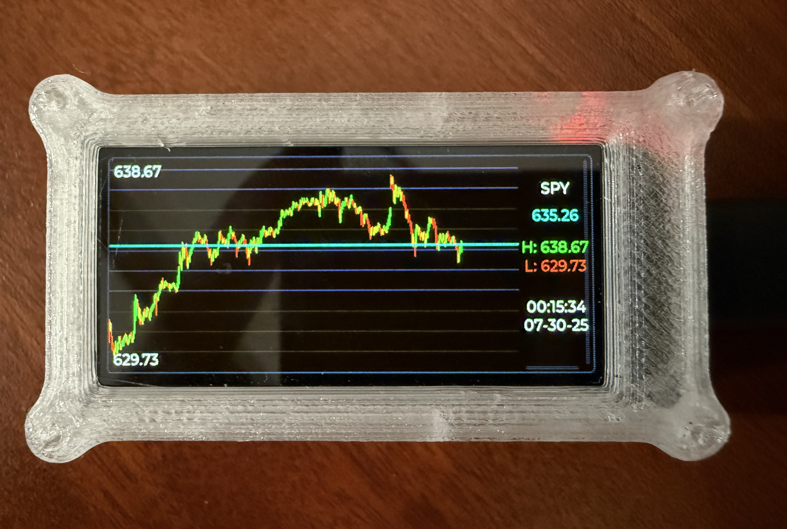

### LilyGo Ticker
Inspired from [this project](https://github.com/nishad2m8/BTC-Ticker), I wanted a simple way to keep up with market price movements during the intraday time frame. This project heavily refactors the linked projects code to accomplish a few key tasks:
1. Pull intraday stock market data for one ticker from yahoo finance
2. Provide a testing mechanism to preview how OHLC data is visualized
3. Lay a framework down to eventually pull data from a separate database, populated using something like [CandleCollector](https://github.com/melo-gonzo/CandleCollector)

The specific board I have been using is the [T-Display S3 AMOLED](https://lilygo.cc/products/t-display-s3-amoled-us?_pos=4&_sid=1d7fdbdc0&_ss=r)

If you need a sweet case, check out [this one](https://www.printables.com/model/1222074-lilygo-t-display-s3-amoled-version-20-case-remix) on Printables! 

This framework supports daily visualizations as well, however it is not the main focus.

### Getting started
1. Clone the repo
   `git clone https://github.com/melo-gonzo/CandleCollector.git`
2. Update wifi credentials in `credentials.h`. Use the `credentials_template.h` for reference. 
3. Update `Config.h` with your timezone, and the maximum number of candles to display in the chart.
4. Update parameters `config.cpp`
   - `USE_TEST_DATA` (bool) - default to `false`. Uses fake, randomly generated OHLC price data when `true`.
   - `USE_INTRADAY_DATA` (bool) - defaults to `true`. Alters the yahoo finance api endpoint where data is queried from. 
   - `INTRADAY_UPDATE_INTERVAL` (int) - refresh rate in seconds. Must be `>=1`. 
   - `CANDLE_COLLECTION_DURATION` (int) - time window used to collate OHLC data. Must be `>= 4*INTRADAY_UPDATE_INTERVAL` to get a full _candle_. 
   - `STOCK_SYMBOL` (char) - stock ticker to collect data for.

Three default configs are prepopulated:
- Intraday with real data (3min candles, 5sec refresh)
- Intraday with fake data (6sec candles, 1sec refresh)
- Daily with real data (5sec refresh. `CANDLE_COLLECTION_DURATION` does not influence anything in this config.)

### Development and Contribution
I took this project as an opportunity to test out some of the latest and greatest LLM's for development. I'm a c++ novice, and thus this was a great opportunity to learn. I stuck primarily with the Claude family of models. I found that the "projects" feature was not super helpful, and that pasting the full codebase (or relevant parts) into the context was most helpful for getting assistance. Therefore, I've included the `print_contents.py` script which is helpful for collating the project into on file that can copy-pasted into the prompt. This was super helpful for me - maybe you will find something else that works for you, or maybe you're a c++ wizard already.

Feel free to contribute via Issues and PR's, I will happily review and incorporate changes where necessary.

### Future Plans
The current workflow pulls data continuously by querying the yahoo finance api, regardless of if the market is open or not. This means that outside of trading hours, the screen displays partial or no data at all. Also, data does not persist across reboots, as it is not saved anywhere.
* Integrate the [CandleCollector](https://github.com/melo-gonzo/CandleCollector) project with this one, and save CandleCollector data to a database, which will help with persisting data across reboots.
* Add a web interface that can be used for dynamically updating params (using test data, ticker, refresh rate, candle window, etc.)
* Clean up the display and add some more info (timestamps, ticker info, etc.)
